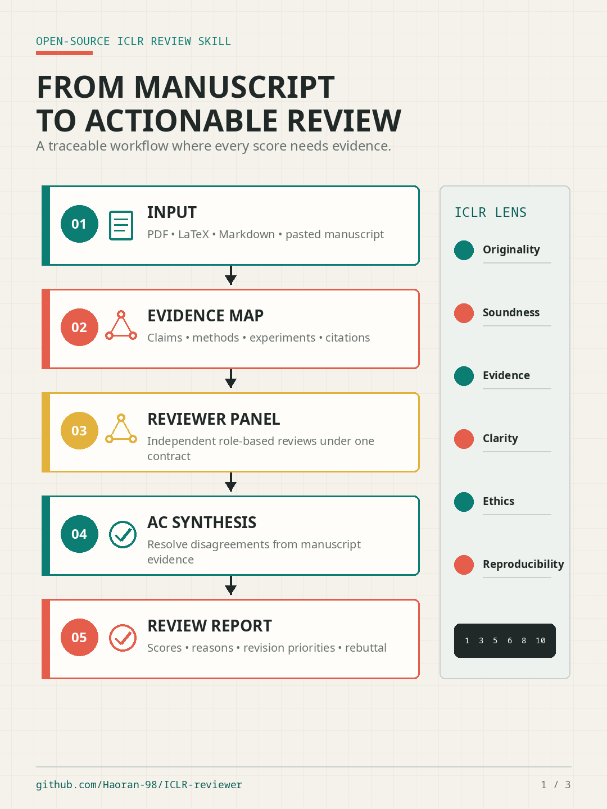
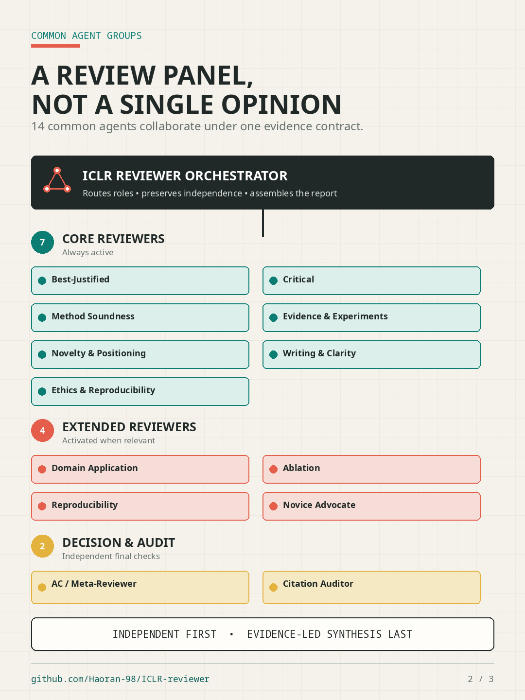
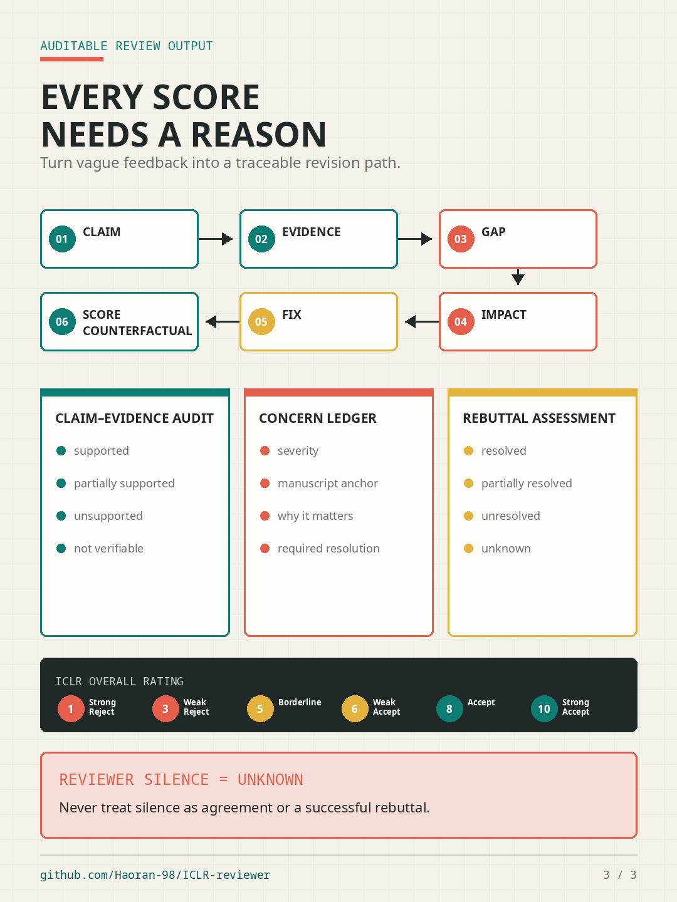

# ICLR Reviewer

[English](README.md)

ICLR Reviewer 将 ICLR 公开论文、审稿意见、作者回复和最终决定整理成可复现的数据与多 Agent 审稿基础设施，用于研究 ICLR 的评分逻辑、审稿趋势、rebuttal 成败、录用因素，以及构建基于证据的审稿人和投稿人模拟。

即使目标是其他会议，项目也统一使用 ICLR 视角审视研究：创新性、技术可靠性、实验与证据、清晰度、可复现性、伦理风险和领域匹配。目标不是模仿可识别的真实个人，而是从公开历史证据中构建可审计的审稿行为模型，并保留不确定性与反事实假设。

## 作为 Codex Skill 使用

克隆仓库并安装内置 Skill：

```bash
git clone https://github.com/Haoran-98/ICLR-reviewer.git
cd ICLR-reviewer
mkdir -p "$HOME/.codex/skills"
ln -s "$PWD/skills/iclr-reviewer" "$HOME/.codex/skills/iclr-reviewer"
```

重启 Codex 后，可以直接审查 PDF、LaTeX 项目、Markdown 稿件或粘贴的论文内容：

```text
$iclr-reviewer 审查 /path/to/paper.pdf，并解释每个评分和修改优先级。
```

对于不能自动发现 Codex Skill 的 Agent：

```text
读取 skills/iclr-reviewer/SKILL.md，并用它审查 /path/to/paper.pdf。
```

输出包含各审稿角色的独立评分、基于稿件证据的优点与问题、claim-evidence 审计、AC 决策、置信度、修改优先级，以及每项修改可能影响评分的原因。提供审稿意见和作者回复后，还会判断哪些问题已经解决，以及为什么应该或不应该提分。

## 图示说明

### 从稿件到可执行审稿报告

系统首先建立论文的证据地图，再运行相互独立的角色审稿，由 AC 根据稿件证据解决冲突，最终输出带原因的评分和修改优先级。

<p align="center">
  
</p>

### 通用 Agent 分组

14 个通用 Agent 覆盖审稿编排、核心科学评审、按需扩展评审、元决策和独立引用审计。领域角色只补充核心面板，不替代核心审稿流程。

<p align="center">
  
</p>

### 证据、原因与反事实

每个重要问题都沿着“论断、证据、缺口、影响、修复、可能评分变化”的链路进行记录。审稿人沉默保持为 `unknown`，不会被解释为同意。

<p align="center">
  
</p>

## 仓库内容

- ICLR 2024-2026 主会论文的题目、摘要和主题目录
- 用于确定性过滤、提取、批处理、校验和审稿画像生成的 Python 脚本
- 通用审稿 Agent 分组及其协作规则
- 可安装的 `$iclr-reviewer` Codex Skill

仓库不包含论文 PDF、Workshop 记录、认证信息、API 请求/响应日志或本机路径。

## 分组审稿 Agent

公开配置位于 [`agents/reviewer_groups.json`](agents/reviewer_groups.json)：

- 核心审稿组：正向论证、严格批判、方法可靠性、实验与证据、创新定位、写作、伦理与复现
- 扩展审稿组：领域应用、消融证据、复现和非专家可理解性
- 决策与审计组：AC / Meta-Reviewer 和独立 Citation Auditor

通用面板始终运行，并可增加最多三个匹配的领域专科角色。AC 必须基于稿件证据解决冲突，不能用平均分掩盖致命问题；引用审计独立于 AC。

### 现有 Agent 分组

<!-- AGENT_GROUPS:START -->
| 分组 | Agent | 作用 | 加入日期 |
|---|---|---|---|
| 编排 | `iclr_reviewer_orchestrator` (ICLR 审稿编排器) | 路由审稿组、保持独立评审，并生成基于证据的最终报告。 | 2026-07-26 |
| 核心审稿组 | `best_justified` (最强正向论证审稿人) | 基于稿件证据构建最充分的接收理由。 | 2026-07-26 |
| 核心审稿组 | `critical` (严格批判审稿人) | 寻找影响最大的未解决失败模式。 | 2026-07-26 |
| 核心审稿组 | `method_soundness` (方法可靠性审稿人) | 检查问题定义、假设、推导、算法和数据泄漏。 | 2026-07-26 |
| 核心审稿组 | `evidence_experiment` (实验与证据审稿人) | 审查基线、控制实验、指标、消融、统计和鲁棒性。 | 2026-07-26 |
| 核心审稿组 | `novelty_positioning` (创新与定位审稿人) | 根据最接近的相关工作检验真实贡献。 | 2026-07-26 |
| 核心审稿组 | `writing_clarity` (写作与清晰度审稿人) | 检查定义、逻辑结构、图表和可读性。 | 2026-07-26 |
| 核心审稿组 | `ethics_reproducibility` (伦理与复现审稿人) | 检查潜在伤害、数据权利、隐私、滥用、局限和复现性。 | 2026-07-26 |
| 扩展审稿组 | `domain_application` (领域应用审稿人) | 验证领域假设、实际效用和评测真实性。 | 2026-07-26 |
| 扩展审稿组 | `evidence_ablation` (消融审稿人) | 检验实验是否隔离了各组件的真实贡献。 | 2026-07-26 |
| 扩展审稿组 | `reproducibility` (复现审稿人) | 根据论文重建实现细节和实验流程。 | 2026-07-26 |
| 扩展审稿组 | `novice_advocate` (非专家可理解性审稿人) | 识别未解释的前置知识和难以理解的表达。 | 2026-07-26 |
| 决策与审计 | `ac_meta_reviewer` (AC / 元审稿人) | 根据证据解决评审冲突，不用平均分掩盖致命问题。 | 2026-07-26 |
| 决策与审计 | `citation_auditor` (引用审计员) | 在来源可用时独立核验引用存在性和论断支持关系。 | 2026-07-26 |
<!-- AGENT_GROUPS:END -->

### 最近 30 天新增 Agent

<!-- RECENT_AGENTS:START -->
| Agent | 分组 | 加入日期 |
|---|---|---|
| `writing_clarity` (写作与清晰度审稿人) | 核心审稿组 | 2026-07-26 |
| `reproducibility` (复现审稿人) | 扩展审稿组 | 2026-07-26 |
| `novice_advocate` (非专家可理解性审稿人) | 扩展审稿组 | 2026-07-26 |
| `novelty_positioning` (创新与定位审稿人) | 核心审稿组 | 2026-07-26 |
| `method_soundness` (方法可靠性审稿人) | 核心审稿组 | 2026-07-26 |
| `iclr_reviewer_orchestrator` (ICLR 审稿编排器) | 编排 | 2026-07-26 |
| `evidence_experiment` (实验与证据审稿人) | 核心审稿组 | 2026-07-26 |
| `evidence_ablation` (消融审稿人) | 扩展审稿组 | 2026-07-26 |
| `ethics_reproducibility` (伦理与复现审稿人) | 核心审稿组 | 2026-07-26 |
| `domain_application` (领域应用审稿人) | 扩展审稿组 | 2026-07-26 |
| `critical` (严格批判审稿人) | 核心审稿组 | 2026-07-26 |
| `citation_auditor` (引用审计员) | 决策与审计 | 2026-07-26 |
| `best_justified` (最强正向论证审稿人) | 核心审稿组 | 2026-07-26 |
| `ac_meta_reviewer` (AC / 元审稿人) | 决策与审计 | 2026-07-26 |
<!-- RECENT_AGENTS:END -->

## 题目与摘要目录

[`raw/`](raw/) 按年份和主会主题展示论文，并为每年提供轻量 JSONL gzip 索引。字段仅包含主题、题目、摘要、关键词、OpenReview ID 和页面链接，不包含 review、rebuttal、decision、作者或 PDF。

当前共收录 38,890 篇主会论文：

- 2024：7,404 篇
- 2025：11,672 篇
- 2026：19,814 篇

[`raw/manifest.json`](raw/manifest.json) 记录论文数、主题数、索引体积和 SHA-256。

## 时间协议

- 2024：训练
- 2025：校准
- 2026：完全留出测试

使用者可以为自己的实验定义其他划分，但项目的历史审稿孪生协议不会把 2026 证据加入画像生成提示词。

## 安装

```bash
python -m venv .venv
source .venv/bin/activate
pip install -r requirements.txt
```

运行本地提取流程：

```bash
export ICLR_REVIEWS_ROOT=/path/to/iclr_reviews
python twin_smoke/extract_priority_topics.py
python twin_smoke/prepare_priority_luna.py --batch-tokens 90000
```

API 运行器通过 `ICLR_AUTH_FILE` 读取兼容 OpenAI 的配置。不要提交认证文件、请求 payload 或模型原始响应。

## 研究边界

- 排除 Workshop 和 PDF 文件。
- reviewer silence 或语义不明确统一标记为 `unknown`。
- rebuttal 分析同时覆盖提分和未提分，并区分观察证据、因果假设与反事实条件。
- 匿名 reviewer ID 不用于推断真实身份。
- 历史模式只支持带不确定性的估计，不保证评分或录用结果。
